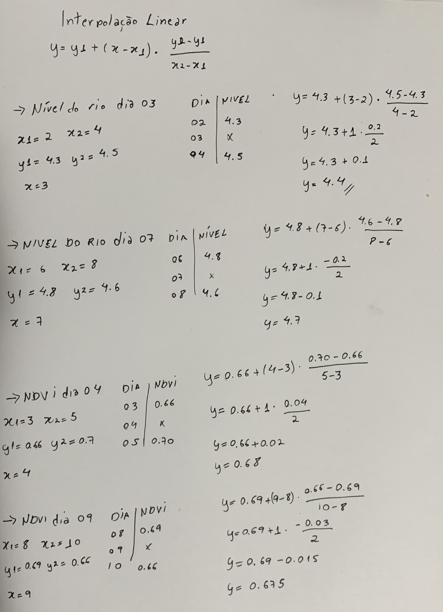
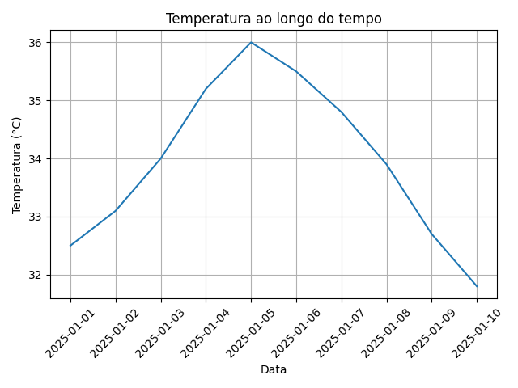
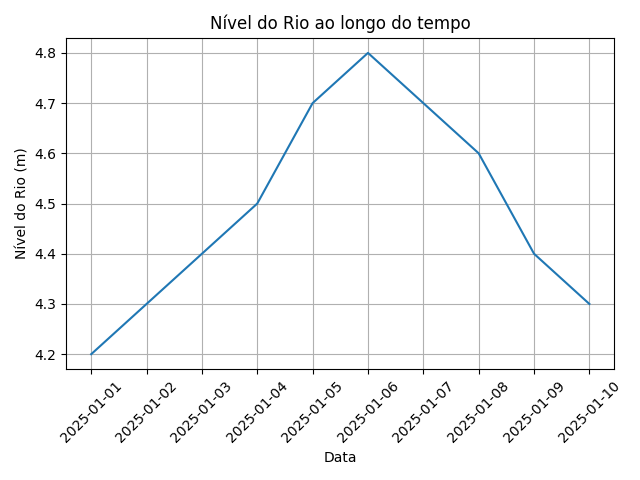
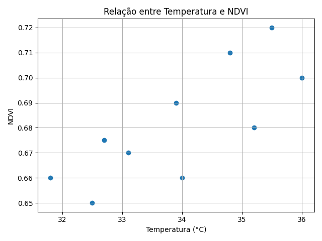
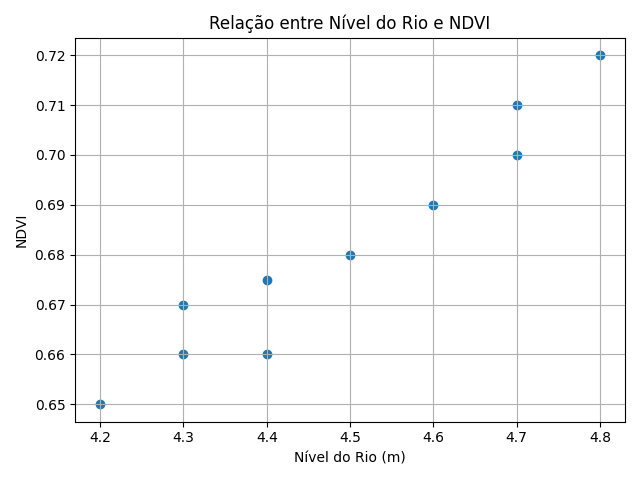

# Desenvolvimento de Plataforma de Dados Ambientais
Pipeline de processamento e análise de dados ambientais (temperatura, nível do rio e NDVI) com tratamento de dados faltantes e visualização em Python.

## Organização 
O projeto está organizado conforme as boas práticas de um projeto de Ciência de Dados. As pastas src, data e outputs representam a separação entre código, entrada e resultado.

``src/``: onde fica os códigos fontes armazenando scripts de pré-processamento, treinamento e configurações de biblioteca.

``data/``: pasta que armazena o conjunto de dados separado em subpastas
``raw/``: para os dados brutos e originais 
``processed/``: dados limpos e transformados 

``outputs/``: pasta onde está salvo os resultados das análises

## Tecnologias Utilizadas
- Python
- Pandas 
- Matplotlib

O python foi escolhido por ser amplamente utilizado em ciência de dados, além de possuir uma sintaxe simples e grande comunidade. Já o pandas foi utilizado para manipulação e análise de dados tabulares, permitindo leitura eficiente de arquivos CSV, tratamento de dados faltantes e cálculo de estatísticas de forma simples e robusta. E o Matplotlib utilizado para criação de gráficos, possibilitando a visualização da evolução temporal das variáveis ambientais de forma clara e personalizável.

## Como foi Feito o tratamento de Dados 

Os dados apresentavam valores ausentes nas variáveis:

nível do rio
NDVI

Foi utilizada **interpolação linear** para preenchimento desses valores, considerando que os dados possuem natureza temporal e variação contínua.

### Cálculos de Interpolação

## Resultados

Cálculo das médias de:

- Temperatura
- Nível do rio
- NDVI

Geração de gráficos temporais:

Evolução da temperatura ao longo do tempo

Evolução do NDVI ao longo do tempo

Evolução do nível do rio ao longo do tempo

Geração de gráficos de dispersão para análise de relações entre variáveis ambientais:
Relação entre temperatura e NDVI

Relação entre nível do rio e NDVI

## Como Executar
1. Criar ambiente virtual
    python3 -m venv venv
2. Ativar ambiente

Caso seja Linux/Mac:

source venv/bin/activate

Caso seja Windows:

venv\Scripts\activate

3. Instalar dependências

pip install -r requirements.txt

4. Executar o projeto

python src/analise.py

## Estrutura do Projeto

``
├── data/
│   ├── dados_pantanal.csv
│   └── dados_pantanal_limpo.csv
├── src/
│   └── analise.py
├── outputs/
│   ├── grafico_temperatura.png
│   ├── grafico_ndvi.png
│   └── grafico_nivel_rio.png
├── requirements.txt
└── README.md
``